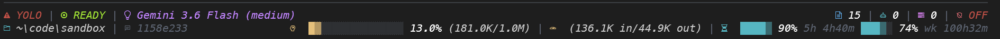
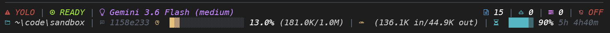

# Antigravity CLI Custom Statusline (Windows)

A responsive, high-performance Rust custom statusline for **Antigravity CLI** on Windows.

## Quick Installation

Run this command in PowerShell:

```powershell
irm https://raw.githubusercontent.com/vmsysadm/agy-statusline-win/main/install.ps1 | iex
```

## Screenshots

| Wide Layout | Medium Layout |
| --- | --- |
|  |  |

## Key Features

- **Blazing Fast**: Native Rust binary compiled for near-zero execution latency.
- **Dual Quota Display**: Displays both 5-Hour and Weekly quotas side-by-side with countdown timers.
- **Responsive Layout**: Dynamically adjusts layout based on terminal width.
- **Rich Diagnostics**: Displays agent state, active model, token counts, git branch, conversation ID, artifacts, subagent count, and background tasks.

## Build from Source

```cmd
git clone https://github.com/vmsysadm/agy-statusline-win.git
cd agy-statusline-win
cargo build --release
powershell .\install.ps1
```

## Running Without Nerd Fonts

If you are running on a Windows Server or standard command prompt without a Nerd Font installed, icons may appear as missing characters or double-width mangled symbols. You can run without Nerd Fonts using two methods:

### Option 1: Built-in Emoji Fallback Mode
Set the `USE_NERD_FONTS` environment variable to `false` in PowerShell:

```powershell
[Environment]::SetEnvironmentVariable("USE_NERD_FONTS", "false", "User")
```

### Option 2: Clean ASCII Text Mode (Recommended for Windows Server)
To avoid any font glyph issues or duplicated label text, copy the provided `ascii_statusline_config.json` configuration to your `%USERPROFILE%\.gemini\antigravity-cli` directory:

```powershell
Copy-Item "ascii_statusline_config.json" "$env:USERPROFILE\.gemini\antigravity-cli\statusline_config.json" -Force
```

**Clean ASCII Output Preview:**
```text
! YOLO | * READY | MOD: Gemini 3.6 Flash (medium)                       ART: 0 | SUB: 0 | TASK: 0 | OFF
DIR: ~\code | ID: c23fc741                  CTX:  ░░░░░░░░░░4.6% (58.4K/1.0M) | TOK: (48.2K in/10.2K out)
```


## Uninstallation

Run this command in PowerShell:

```powershell
irm https://raw.githubusercontent.com/vmsysadm/agy-statusline-win/main/uninstall.ps1 | iex
```

## Credits & License

- Derived from [agy-statusline](https://codeberg.org/jochenkirstaetter/agy-statusline) by **Jochen Kirstätter** ([@jochenkirstaetter](https://codeberg.org/jochenkirstaetter)).
- Licensed under the **MIT License**.
